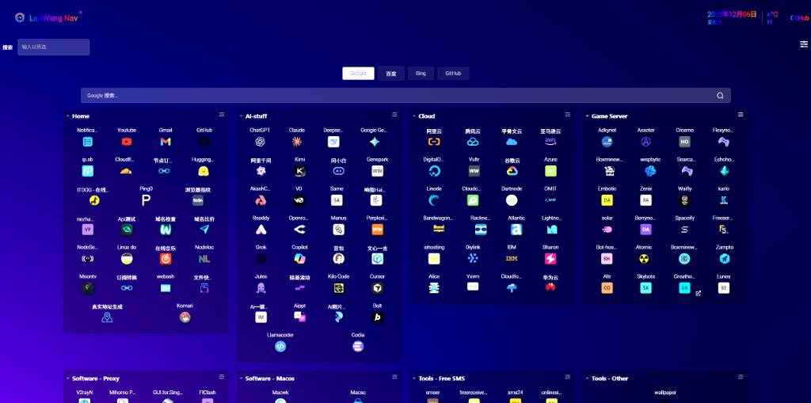
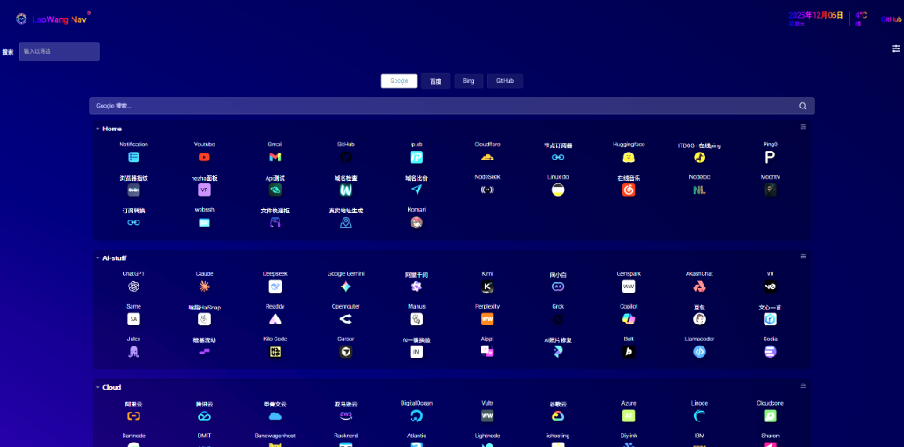
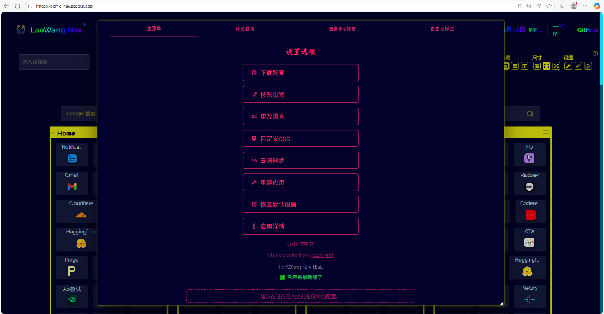
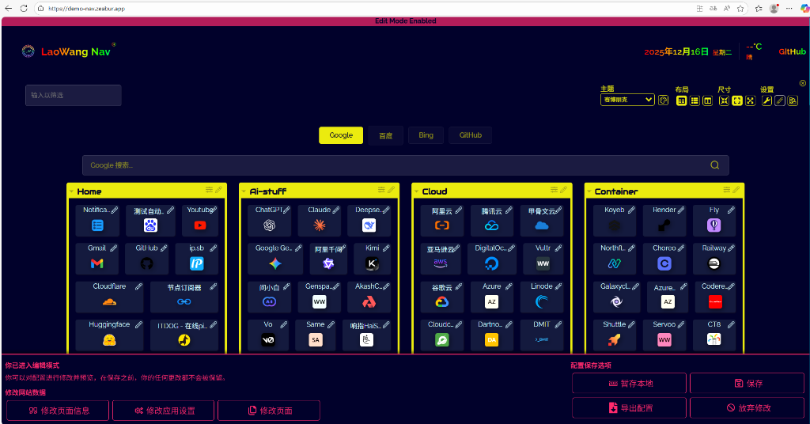

# LaoWang Nav

**一个漂亮、易用、功能强大的自托管导航页**

[](https://github.com/tony-wang1990/laowang-nav/blob/master/LICENSE)
[](https://github.com/tony-wang1990/laowang-nav/releases)
[](https://vuejs.org/)
[](https://www.typescriptlang.org/)
[](https://hub.docker.com/)
[](https://github.com/tony-wang1990/laowang-nav/stargazers)

> [!NOTE]
> **v1.2.1 重大更新** - 完全重构配置保存机制，现在您的自定义配置和URL修改会永久保留！详见 [v1.2.1 更新说明](#-v121-版本更新说明)

[**在线演示**](https://demo-nav.zeabur.app/) | [**快速开始**](#-快速开始) | [**功能特性**](#-特性) | [**部署指南**](#-部署方式)

---

## 📸 截图预览

<div align="center">

### 🌐 在线演示

[](https://demo-nav.zeabur.app/)

> [!IMPORTANT]
> ### ⚠️🚨 首次访问加载提示 🚨⚠️
> 
> 🔴 **【重要】** 由于项目包含丰富的功能和资源文件，***首次访问可能需要 30-60 秒***的加载时间，请耐心等待！
> 
> ✅ **后续访问会非常快速** - 浏览器会缓存静态资源，再次访问几乎秒开！
> 
> 💡 **建议**：首次访问时保持页面打开，等待完全加载后再体验功能。

---

### 🖥️ 桌面端主页 - 多栏布局

[](https://demo-nav.zeabur.app/)

*👆 点击图片体验在线 Demo | 支持多栏分类展示，一目了然查看所有导航卡片*

---

### 📱 响应式分类列表



*智能响应式布局，自动适配不同屏幕尺寸*

---

### 🎨 内置多彩主题切换



*20+ 精美内置主题，支持自定义 CSS 样式*

---

### ✏️ 可视化编辑模式



*无需代码，可视化拖拽编辑，实时预览保存*

</div>

---

## ✨ 特性

- 🚀 **极速加载**: 经过优化的代码，秒级响应
- 🎨 **多主题支持**: 内置 20+ 精美主题，支持自定义 CSS
- ☁️ **多云一键部署**: 支持 Zeabur、Vercel、Railway 等平台
- 🔍 **集成搜索引擎**: 
  - 桌面端：站内快速筛选
  - **移动端**：支持 Baidu/Bing/Google 全网搜索切换
- 🌦️ **实时天气**: 首页集成实时天气与日期显示
- 📱 **响应式设计**: 完美适配手机、平板和桌面端
- 🔄 **自动同步**: 定期从 [nav.eooce.com](https://nav.eooce.com) 自动同步导航数据
- 🔒 **隐私优先**: 所有数据掌握在自己手中

---

## 📋 更新日志

### v1.2.1 (2025-12-16)

#### 🎯 核心修复：配置保存过滤机制

**问题修复：**
- ✅ 修复保存配置时包含冗余同步数据导致更新阻塞的问题
- ✅ 实现智能过滤机制，只保存真正的用户修改
- ✅ 采用配置分层架构（基础层 + 补丁层），完美解决同步覆盖问题

**新功能：**
- ✨ 新增 `ConfigFilter.js` 工具，自动过滤未修改的同步数据
- ✨ 修改 `ConfigSaving.js`，保存前智能识别并过滤冗余内容
- ✨ 确保 `conf.yml` 只包含用户的真实修改和自定义内容

**工作原理：**
```
用户界面
  ↓ 保存配置
  ↓ 过滤掉未修改的同步数据
  ↓
user-data/conf.yml ← 只包含用户修改
  ↓
  ↓ 作为补丁层覆盖基础数据
  ↓
允许 data/synced_sections.json 的更新正常传播 ✅
```

**匹配规则：**
- 按 `title` 字段匹配卡片
- 如果名字相同但内容不同 → 保存（用户修改）
- 如果名字相同且内容完全相同 → 不保存（让同步数据自动更新）
- 如果名字不在同步数据中 → 保存（用户自定义）

**文件变更：**
- `src/utils/ConfigFilter.js` - 新增配置过滤工具
- `src/mixins/ConfigSaving.js` - 修改保存逻辑，添加过滤步骤
- `tests/test_filter.js` - 新增单元测试

**测试验证：**
- ✅ 所有4个单元测试场景通过
- ✅ 生产构建成功
- ✅ 配置分层架构测试通过

**升级说明：**
- Docker用户：`docker pull ghcr.io/tony-wang1990/laowang-nav:latest && docker restart laowang-nav`
- Git用户：`git pull origin master && npm install && npm run build && npm start`

---

### v1.2.0 (2025-12-14)

#### 🎯 核心修复：自动同步机制重构

**问题修复：**
- ✅ 修复自动同步覆盖用户自定义分类和卡片的问题
- ✅ 修复URL修改在同步后被恢复的问题
- ✅ 实现分离数据架构，远程同步数据不再覆盖用户配置

**新功能：**
- ✨ 新增配置覆盖机制，支持在 `user-data/conf.yml` 中覆盖任何远程卡片
- ✨ 新增智能合并逻辑，用户配置优先级最高
- ✨ 新增配置合并工具 `scripts/utils/merge-config.js`

**用户体验改进：**
- 🎨 优化移动端编辑模式布局，限制高度为40vh并支持滚动
- 🎨 移动端编辑模式隐藏提示文本，节省空间
- 🧹 清理过时的同步脚本（keji8相关）
- ✨ **新增自定义同步源功能**，Fork用户可追踪自己喜欢的大佬导航

**技术改进：**
- 🔧 同步数据保存到 `data/synced_sections.json`
- 🔧 GitHub Actions 只更新同步数据，不触碰用户配置
- 🔧 服务端添加 `/conf.yml` 端点提供合并后的配置
- 📚 完善文档，添加详细的使用场景和示例

**文件变更：**
- `scripts/sync/sync_nav.js` - 修改同步目标文件
- `.github/workflows/auto-sync.yml` - 修改提交内容
- `scripts/utils/merge-config.js` - 新增配置合并工具
- `server.js` - 新增合并配置端点
- `src/components/InteractiveEditor/EditModeSaveMenu.vue` - 优化移动端布局
- `README.md` - 更新文档

---

## 🔄 自动同步功能

> [!IMPORTANT]
> **本项目内置自动同步功能**，每天从 [nav.eooce.com](https://nav.eooce.com) 获取最新导航数据。
>
> **v1.2 版本已完全解决同步覆盖问题！** 您的自定义配置和URL修改会永久保留！

### ✨ 功能特点

| 特性 | 说明 |
|------|------|
| ⏰ **定时同步** | 每天北京时间凌晨 3:00 自动运行 |
| 🔀 **分离存储** | 远程数据保存到 `data/synced_sections.json` |
| 🛡️ **保护用户配置** | `user-data/conf.yml` 永不被覆盖 |
| ⚙️ **智能合并** | 启动时自动合并，用户配置优先 |
| 🌐 **全平台支持** | VPS、Docker、Vercel、Cloudflare 等全部支持 |

### 🎯 使用场景

**场景1：添加自定义分类**
```yaml
# 在 user-data/conf.yml 中添加完全自定义的分类
sections:
  - name: 我的工具
    icon: emojiicons:tools
    items:
      - title: 自定义工具
        url: "https://mytool.com"
```

**场景2：覆盖远程卡片URL**
```yaml
# 修改远程同步的GitHub卡片URL
sections:
  - name: Home
    items:
      - title: GitHub  # 与远程卡片相同的标题
        url: "https://github.com/tony-wang1990"  # 使用您的URL
```

**场景3：完全自定义配置**
```yaml
# user-data/conf.yml 中可以：
# ✅ 添加新分类
# ✅ 覆盖任意远程卡片
# ✅ 修改顺序、图标、描述等任何属性
# ❌ 不会被每日同步覆盖
```

### 🎯 自定义同步源（适合Fork用户）

> [!NOTE]
> **关于默认同步源**
> 
> 本项目作者崇拜并追踪**佬王大佬**的导航站点 ([nav.eooce.com](https://nav.eooce.com))，因此默认同步源设置为该站点。
> 
> 如果您Fork了本项目，可以自由选择追踪您喜欢的大佬导航站，或者完全禁用同步功能。

**方法一：前端界面设置（推荐）**

1. 进入编辑模式（点击右上角编辑按钮）
2. 点击「修改应用设置」按钮
3. 找到**「导航同步源」**字段
4. 输入您想追踪的导航源URL，例如：`https://your-idol.com`
5. 保存配置

**方法二：直接修改配置文件**

在 `user-data/conf.yml` 中添加：
```yaml
appConfig:
  syncSourceUrl: "https://your-idol-nav.com"
```

**方法三：修改默认值（不推荐**

编辑 `src/utils/defaults.js` 第205行：
```javascript
syncSourceUrl: 'https://your-nav-source.com',
```

> [!IMPORTANT]
> **同步源API要求**
> 
> 自定义同步源必须提供以下API端点：
> - `GET /api/menus` - 返回导航分类列表
> - `GET /api/cards/{menuId}` - 返回指定分类的卡片数据
> 
> 数据格式必须与 nav.eooce.com 兼容。

**常见问题解答：**

<details>
<summary><b>Q1: 追踪其他导航站会同步它的样式吗？</b></summary>

**A: 不会！只同步数据，不同步样式。**

同步内容：
- ✅ 卡片数据（标题、描述、图标、URL）
- ✅ 分类结构
- ❌ 样式/主题（使用本项目自己的CSS）
- ❌ 布局结构（使用本项目的Vue组件）

**您看到的永远是LaoWang Nav的样式，只是数据来自其他导航站。**
</details>

<details>
<summary><b>Q2: 如果我修改了同步过来的卡片URL，第二天会被覆盖吗？</b></summary>

**A: 不会！这正是v1.2的核心修复。**

工作原理：
1. 远程数据保存到 `data/synced_sections.json`
2. 您的修改保存在 `user-data/conf.yml`
3. 启动时自动合并，**您的配置优先级最高**
4. 即使每天同步，您的修改永不丢失

示例：
```yaml
# 在 user-data/conf.yml 中
sections:
  - name: Home
    items:
      - title: GitHub  # 与远程卡片同名
        url: "https://github.com/my-account"  # 您的URL
        # 第二天同步后，依然显示您的URL！
```
</details>

<details>
<summary><b>Q3: 输入同步源URL的格式要求？</b></summary>

**A: 必须包含完整的HTTP/HTTPS协议。**

- ✅ 正确：`https://nav.example.com`
- ✅ 正确：`http://192.168.1.100:8080`
- ❌ 错误：`nav.example.com`（缺少协议）
- ❌ 错误：`www.example.com`（缺少协议）
</details>

<details>
<summary><b>Q4: 其他导航站的API格式不一样怎么办？</b></summary>

**A: 需要修改同步脚本适配或要求对方提供兼容API。**

目前支持的API格式（eooce标准）：
```javascript
// GET /api/menus
[{
  id: "1",
  name: "Home",
  subMenus: [{id: "1-1", name: "Tools"}]
}]

// GET /api/cards/1
[{
  title: "GitHub",
  description: "Code hosting",
  icon: "https://...",
  url: "https://github.com"
}]
```

如需支持其他格式，需修改 `scripts/sync/sync_nav.js` 中的 `transformCard` 函数。
</details>

** 🚫 如何禁用自动同步

如果您 Fork 了本项目，**不需要自动同步功能**，请按以下步骤操作：

#### 方法一：删除工作流文件（推荐）

```bash
# 删除自动同步工作流文件
rm -rf .github/workflows/auto-sync.yml

# 提交更改
git add .
git commit -m "禁用自动同步功能"
git push
```

#### 方法二：注释定时任务

编辑 `.github/workflows/auto-sync.yml`：
```yaml
on:
  # 注释掉定时任务
  # schedule:
  #   - cron: '0 19 * * *'
  workflow_dispatch:  # 保留手动触发
```

> [!TIP]
> 禁用后，您仍可手动运行 `npm run sync` 按需同步。

---

## 🚀 快速开始

### 方式一：一键部署到云平台

无需服务器，完全免费：

| 平台 | 部署链接 |
|------|----------|
| **Zeabur** (推荐) | [](https://zeabur.com/templates/2Q624P) |
| **Vercel** | [](https://vercel.com/new/clone?repository-url=https://github.com/tony-wang1990/laowang-nav) |
| **Railway** | [](https://railway.app/new/template?template=https://github.com/tony-wang1990/laowang-nav) |
| **Render** | [](https://render.com/deploy?repo=https://github.com/tony-wang1990/laowang-nav) |

### 方式二：Docker 部署

> 💡 **多架构支持**：Docker 镜像同时支持 **AMD64** (Intel/AMD 服务器) 和 **ARM64** (树莓派/Oracle ARM 等)，自动适配您的服务器架构！

```bash
docker run -d \
  -p 8080:8080 \
  --name laowang-nav \
  --restart always \
  ghcr.io/tony-wang1990/laowang-nav:latest
```

访问 `http://localhost:8080`

### 方式三：本地开发

```bash
# 克隆仓库
git clone https://github.com/tony-wang1990/laowang-nav.git
cd laowang-nav

# 安装依赖
npm install

# 开发模式
npm run dev
```

访问 `http://localhost:8080`

---

## ⚙️ 配置说明

###  基础配置

配置文件位于 `user-data/conf.yml`：

```yaml
pageInfo:
  title: LaoWang Nav
  description: 个人导航站
  
appConfig:
  theme: colorful
  
sections:
  - name: 常用工具
    items:
      - title: GitHub
        description: 代码托管平台
        icon: https://github.com/favicon.ico
        url: https://github.com
```

### 📝 什么是"自定义配置"？（重要）

> [!NOTE]
> **核心概念：`user-data/conf.yml` 中的所有内容都是自定义配置！**

#### 🎯 自定义配置包括：

1. ✅ **修改远程卡片URL** - 算自定义配置
2. ✅ **修改远程卡片图标/描述** - 算自定义配置  
3. ✅ **创建全新分类** - 算自定义配置
4. ✅ **创建全新卡片** - 算自定义配置
5. ✅ **任何手动编辑conf.yml的内容** - 算自定义配置

#### 🔍 系统如何识别并保护您的自定义？

**两层匹配机制：**

**第一层：Section（分类）匹配**
- 匹配规则：`name` 字段完全一致
- 示例：远程有 `"开发工具"`，您的conf.yml也写 `"开发工具"` → 匹配成功

**第二层：Item（卡片）匹配**
- 匹配规则：`title` 字段完全一致
- 示例：远程有GitHub卡片 `title: "GitHub"`，您也写 `title: "GitHub"` → 匹配成功
- **匹配后**：您的配置覆盖远程配置

#### 📖 实战示例

**场景1：修改远程卡片的URL**

```yaml
# 远程同步的数据（data/synced_sections.json）自动包含：
# - name: 开发工具
#   items:
#     - title: GitHub
#       url: https://github.com
#       description: 代码托管平台

# 您在 user-data/conf.yml 中添加：
sections:
  - name: 开发工具        # ← 必须和远程分类名完全一致
    items:
      - title: GitHub    # ← 必须和远程卡片标题完全一致
        url: "https://github.com/tony-wang1990"  # ← 您的URL
        description: "我的GitHub主页"             # ← 可选：同时修改描述

# 最终显示结果（自动合并）：
# - url: https://github.com/tony-wang1990  ← 您的URL ✅
# - description: 我的GitHub主页            ← 您的描述 ✅
# - icon: [远程图标]                       ← 您没改，用远程的
```

**场景2：创建全新分类**

```yaml
# 在 user-data/conf.yml 中添加：
sections:
  - name: 我的收藏        # ← 远程没有这个分类名
    icon: fas fa-heart
    items:
      - title: 我的博客
        url: https://myblog.com
        icon: favicon
      - title: 个人项目
        url: https://myproject.com

# 结果：
# - 这个分类永久保留 ✅
# - 不受每日同步影响 ✅
# - 完全属于您的自定义 ✅
```

**场景3：在远程分类中添加新卡片**

```yaml
# 远程已有"开发工具"分类
# 您想添加自己的工具到这个分类

sections:
  - name: 开发工具       # 使用远程已有的分类名
    items:
      - title: 我的工具  # 远程没有这个title
        url: https://mytool.com
        icon: favicon

# 结果：
# - "开发工具"分类显示：远程所有卡片 + 您的"我的工具" ✅
# - 您的卡片永久保留 ✅
```

#### ⚠️ 匹配注意事项

**❌ 常见错误：**

```yaml
# 错误1：分类名不一致
远程: name: "开发工具"
您写: name: "开发工具集"    # ❌ 不匹配！会创建新分类

# 错误2：标题大小写不一致  
远程: title: "GitHub"
您写: title: "Github"      # ❌ 不匹配！会创建新卡片

# 错误3：标题有空格差异
远程: title: "VS Code"
您写: title: "VSCode"      # ❌ 不匹配！
```

**✅ 正确做法：**
1. 复制粘贴远程的 `name` 和 `title`（确保完全一致）
2. 然后修改您想改的属性（url, icon, description）

#### 💡 简单总结

| 操作方式 | 保存位置 | 是否被同步覆盖 | 优先级 |
|---------|----------|----------------|--------|
| 编辑模式修改 | conf.yml | ❌ 不会 | 🔴 最高 |
| 手动编辑conf.yml | conf.yml | ❌ 不会 | 🔴 最高 |
| 远程同步数据 | synced_sections.json | ✅ 每天更新 | 🟢 较低 |

**核心思想：conf.yml 里的内容 = 您的自定义 = 永不被覆盖！**

---

## 🛠️ 技术栈

| 类型 | 技术 |
|------|------|
| 前端 | Vue.js 2.7, TypeScript |
| 构建 | Webpack, Vue CLI |
| 样式 | SCSS, CSS Variables |
| 部署 | Docker, Node.js |

---

## 📚 文档

- [快速开始](docs/quick-start.md)
- [配置指南](docs/configuring.md)
- [主题定制](docs/theming.md)
- [部署文档](docs/deployment.md)

---

## 🙏 致谢

> 💡 本项目基于 [Dashy](https://github.com/Lissy93/dashy) 二次开发，增加了中文本地化和功能增强。感谢原作者的开源贡献！

---

### ☁️ 云端备份配置

默认情况下，云端备份功能已禁用（不连接任何外部服务器）。
如需启用，请在 `user-data/conf.yml` 的 `appConfig` 部分添加您的自建服务地址：

```yaml
appConfig:
  # ... 其他配置
  backupEndpoint: 'https://your-sync-server.com'
```

---

## 📄 许可证

<div align="center">

[](https://github.com/tony-wang1990/laowang-nav/blob/master/LICENSE)

**开源协议** · 学习研究 · 个人使用 · 风险自负

</div>

> 📜 本项目采用 **MIT 许可证**，**仅供学习和个人使用**。
> 
> ⚠️ **重要免责声明**：
> - 本软件按"原样"提供，不提供任何形式的明示或暗示保证
> - 作者不对使用本软件造成的任何损失或问题承担责任
> - 使用本软件即表示您同意自行承担所有风险
> - 商业使用请谨慎评估并承担相应责任
> - 同步的第三方数据版权归原网站所有

---

<div align="center">

**[⬆ 回到顶部](#laowang-nav)**

Made with ❤️ by [LaoWang](https://github.com/tony-wang1990)

⭐ 如果觉得不错，请给个 Star！

</div>

